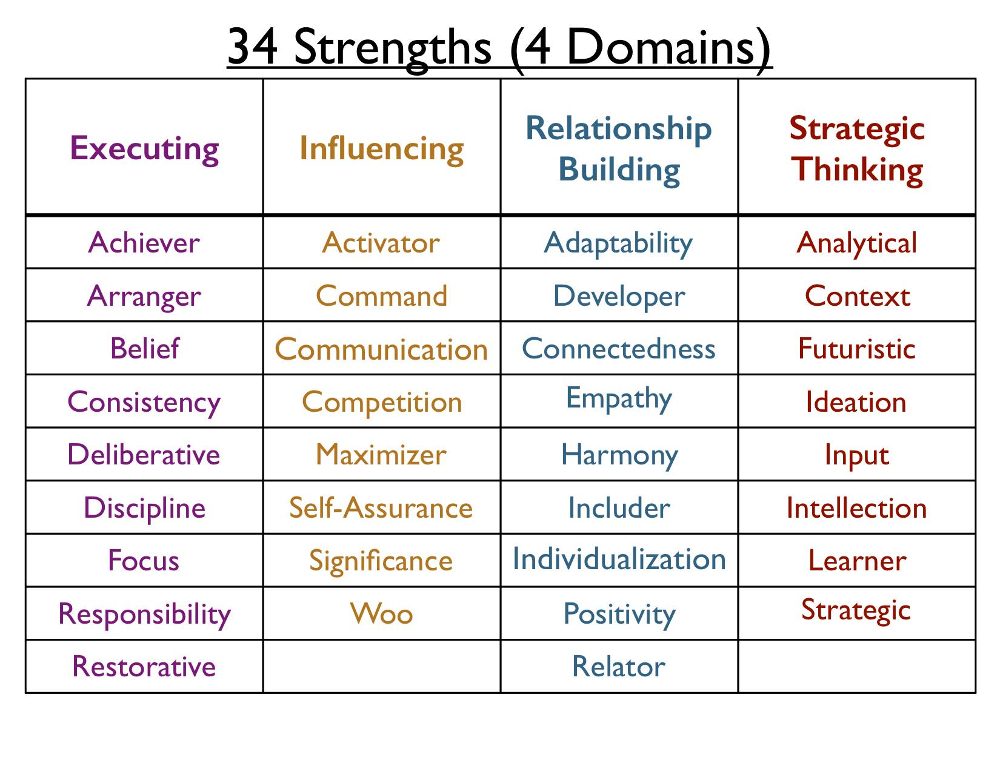

# Strengths Assessment

After the advice of a manager at Microsoft, I took a free version of
CliftonStrengths at [high5test.com](http://high5test.com).
CliftonStrengths measures 34 strengths:

I would say that I could check off... achiever, adaptability, context,
learner, responsibility, and strategic. But what did my results of the
test say?

1. Philomath: Your objective is to learn new things. You have a genuine
   thirst for knowledge and others appreciate your curiosity. You’re not
   necessarily interested in becoming a subject matter expert - it’s the
   process itself that excites you. Because you enjoy the process, you
   like to experiment with different styles of learning, and you know
   that each style comes with its own valuable lessons. You like to
   learn things quickly then shift your attention to something new. That
   ’s why you thrive in short projects and dynamically changing
   environments. Thanks to this strength, you’re always able to
   contribute valuable new knowledge to your team as well.
1. Deliverer: Your underlying goal is to take responsibility. If anyone
   is emotionally bound to following through on their promises, it’s
   you, the Deliverer. Your strong ethical principles don’t allow you to
   simply write off missteps with excuses and rationalizations. And this
   holds true no matter how small or large the issue. Your name and
   reputation depend on you being responsible for your commitments. That
   ’s why people love to have you on their team. You’re the first person
   they turn to when assigning new responsibilities, because they’re
   100% sure that whatever needs to be accomplished will get done.
1. Analyst: Your objective is to analyze in order to find root causes.
   It’s not that you don’t like ideas, concepts and theories — it’s that
   you want to see these proven. And what better way to prove something
   than with data? Although unbearable for some, large quantities of
   data make you feel like a fish in water. It helps you be objective,
   unbiased and dispassionate. You’re constantly on the lookout for the
   patterns, connections and causes behind any result. Others see you as
   logical and rigorous, and often come to you for your unbiased
   perspective on ideas. Being able to deliver your analysis kindly
   makes you a great asset to any team full of daydreamers.
1. Coach: Your goal is to develop people’s potential. You believe that,
   contrary to what some might think, everybody has the potential for
   development. No-one has ever reached the ultimate level of excellence
   — there is always room for growth. It is your personal mission to
   help others realize and use their potential to experience success. As
   a result, you always look for ways to facilitate their learning, from
   challenging their thoughts in a discussion to creating environments
   that facilitate progress. As a leader, you truly care about the
   development of your team members, and they respect you for that.
1. Strategist: Your objective is to see the big picture. Have you heard
   of “taking the helicopter view”? Well, you are constantly on this
   helicopter! This special way of looking at the world at large is more
   than just a skill — it’s a perspective that allows you to see how
   everything is interconnected. Others may be confused by your
   short-term moves, but in your mind you have a vivid multi-step
   strategy to get you to your goal. You don’t take paths that lead
   nowhere. Instead, you find clear direction in even the most complex
   situations, which makes you an essential asset to any forward-looking
   team.

There's also a link to share with others, but I won't share that here.
I think it's important to identify the strengths that you have so that
you can use those strengths, and so that you may identify weaknesses
that you have in order to improve on weaknesses that you want to have.

