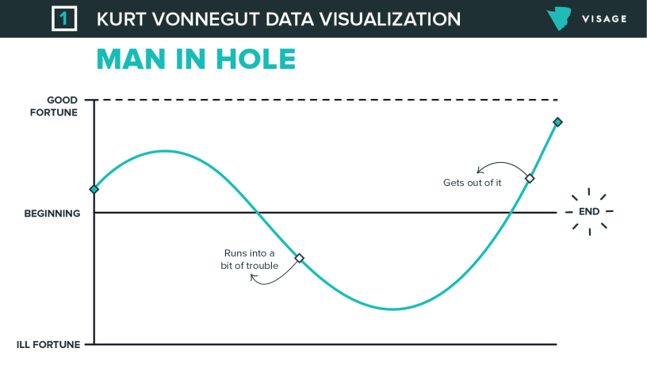

# How to Tell a Good Story

YouTuber Meta made an incredible video, [Don't Get Down-Leveled or How to Tell
a Good Story (From a Principal at
Amazon)](https://www.youtube.com/watch?v=hU6BVxtGd5g). Although I'm not
concerned about the down-leveling part (right now), I am super interested in
telling a good story.

## Describing Yourself is Important

Your ability to describe yourself to potential new teams, recruiters, and
during performance review is important. Teams are trying to fill a specific
need; hiring someone at too high of a level takes a lot of time and resources
to fix. It's uncomfortable for all parties.

## Why People Get Down-Leveled

Uncomfortable for all parties employed; companies employ down leveling. You'll
be in a world of trouble if you can't perform at your level; your goal should
be to be at the right level of the new company.

A strong behavioral component can save you from being down leveled if you
didn't do well on the design/coding portion. Good stories only have one form.

Show them how good you are, don't tell them.

## Describing a Friend

Imagine that you're trying to describe a good friend to someone who hasn't met
them.

- Bad: Oh my buddy Meta, yeah he's good. He's smart, kinda funny, a little
quirky. You know.
- Good: Meta? That guy? He's been at Amazon for 15 years so he's either tough
as nails or really stupid. I don't know how he does it, he has this demanding
job, he just had a kid, and he still has time to make these quirky YouTube
videos. Classic Meta.

## STAR is Bad

STAR is a terrible algorithm for generating stories, because it focuses on what
happened rather than developing the character (you). The goal of the story is
to determine if there is a good match between you and what the company needs.
Use the STAR method only to figure out if a story is worth telling.

## Use "Man in a Hole"

Instead use the "Man in a Hole" story (Kurt Vonnegut). You start by anchoring
the story with your status and responsibilities on the team from the job
description; layer in conflict, challenges, and obstacles (make it thick so
success is satisfying). Man in a Hole has a U-Shape:

## A Good Story and a Bad Story

Story created using STAR:

- **Situation**: My team and I inherited some software from another team since
it made sense for our team to own it. It was really buggy and adding a lot of
operational burden; it had a dependency on a library that represented a large
security risk. Corporate policy was that we migrate away from the library, but
we had a big launch coming up soon.
- **Task**: I worked with clients to move them off the service so that we can
deprecate it.
- **Action**: It was a ton of work, but the service is now decomissioned and we
don't get page din the night as much as we used to.
- **Result**: The system architecture is much simpler now, and we know how our
data is being used downstream.

Story created using U-Story:

- Establish status: I was the team lead on a team of 8 SDEs that was
responsible for several mission critical data plane services for our flagship
product. I was responsible for not just system components or the features that
my team owned, but the architecture. I spoke with an adjacent team to take
ownership with software they owned because it aligned more with our team's
charter.
- Quick challenge and climb: Turns out it was pretty buggy but that wasn't a
big deal after I squashed bugs and added unit & integration tests.
- Another challenge: The big issues started later, it started paging our
on-call late at night, and people would restart the process and move on. I dug
into the issue when I was on-call and discovered we depend on sus4j; its usage
is not allowed in the company and we needed to move away from it; it would take
a month and we were coming up on an important deadline.
- More challenges: Deprecating the service was the best call, and they posed a
lot of problems because we didn't know who all was using the service.
- The climb: I turned on passthrough mode to identify clients; it didn't stop
them from getting data but it let us know who they were. I split the clients up
amongst our team members, and I went to our VP to get an exception for not
removing sus4j for a couple of months. We let the client teams know that the
service will be turned off in a few months, and we helped them move to our
existing endpoints. It disrupted our schedule but didn't blow up our project.
- Another challenge: There was one team who pushed back on us; we didn't have
APIs to help them and they escalated up the management chain. We didn't have
bandwidth to work with them while we were heads down trying to launch.
- Climb: We did what we could to help them after our launch to deliver the
functionality they needed. Even today relations between our teams today are a
bit strained. It all worked out today, I'm pretty happy with the way the
architecture works.

## Be Authentic

Your goal is to make it easy for the interviewer to make a judgment on your
status.

Don't make stuff up. There may be a chance you get away with it, but you most
likely won't be able to answer follow-up questions about it. If there's a
suspicion you're telling talltales, or obviously telling someone else's story
(because you're close to the action), you won't get an offer.

Don't make a villain; if you have challenges (such as a difficult coworker),
don't make them evil -- present it as a challenge and focus on how you overcame
the challenge. Never describe a perfect success; life is too messy, the ending
should be balanced and it will be suspicious about the story's authenticity.
