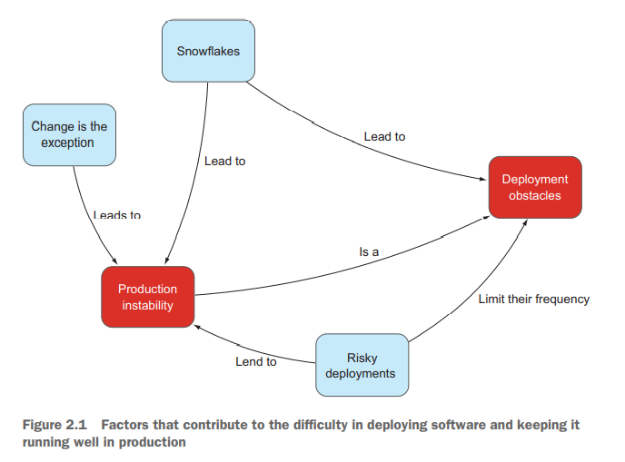

# Cloud Native Patterns - Ch. 2, Running cloud-native applications in production

[Cloud Native Patterns by Cornelia
Davis](https://www.goodreads.com/book/show/36410104-cloud-native-patterns)

## Summary

- Old vs new:
  - Old mindset: Test extensively before production and work out all the
    possible kinks.
  - New mindset: Have best practices and designs in place in order to
    plan for failure and always leave a retreat path.
- Get code deployed easily and frequently; keep it running well in
  production.
  - When this doesn't happen, it's not the fault of devs or ops, it's
    the fault of the system itself.
- When a deployment is risky, it happens infrequently, which creates
  additional riskiness.
- Repeatability is the core of optimized IT operations.
- Finer granularity throughout the system is key: shorter dev cycles &
  smaller app components creates agility and resilience.
- Eventual consistency reigns supreme in a system where change is the
  rule and not the exception.

## The Obstacles

- Handling production operations is a difficult and thankless job.
  Application development groups and operations teams may blame each
  other for failure to serve customers.
- Fear of the consequences of a deployment has the effect of limiting
  the frequency with which you can deploy.
  - It isn't unusual for a deployment to require downtime or cause
    unexpecterd downtime, which is expensive.
  - There are labor costs associated with keeping test environment in
    line with production, complicated by need to remove PII from test
    data.
  - When something goes unplanned in testing, complications can cause
    the environment that's designed to ensure deployments go well to
    become a bottleneck.
  - Deployments are risky enough that most businesses have time periods
    in which new deployments into production aren't permitted:
    open-enrollment for health insurance, between Thanksgiving and
    Christmas for e-commerce, etc.
- Without mechanism for providing exactly the same environment for
  development/testing/staging/production, it's easy for software to
  depend on something that's lacking in a different environment.
  Different, unique environments are snowflakes.
  - You change property files between dev, test, staging, and
    production. You risk having differences between environments creep
    across environments.
- When the development team disengages from ongoing operations after
  a deployment is stable, instability is experienced when something
  unexpected occurs that the ops team isn't aware of.
- **Continuous delivery** doesn't mean every code change is deployed; it
  means that the newest possible version is deployable at any time. This
  means that there must be a cycle of add feature, test, ready to ship
  (even if it doesn't ship).
  - CD is the best value for the easiest amount of effort. It should be
    the first step a team takes if they aren't already practicing CD.
- Planning for the happy path, where plans don't change, feedback isn't
  received and acted on, and everything goes right results in a poor
  estimate.
- **Infrastructure as code**: Begin with a base image and apply a script
  to get the environment to where you need it to be, so that you're
  guaranteed the same environment each time. Changes would ideally only
  come from the script.
- Don't hardcode values into your artifacts; use a property file, and on
  top of that, inject the properties using property parameters to make
  environment specific changes.
- Having everything automated means that nothing will change; servers
  aren't touched directly by humans by design, which could cause
  unexpected behavior.
- Born-in-the-cloud-era software companies experiment *safely* in
  production. Compare to trapeze artists performing over a safety net.
  - First work on minimizing the chance of failure through test-driven
    development, operational best practices, and software design
    patterns. It won't be entirely eliminated, and that's where
    expected experimentation in production takes place. With proper
    practices in place, a return to a working state is easy.
- A deployment safety net have three essential patterns: parallel
  deployments/versioned services, generation of necessary telemetry, and
  flexible routing.
- Implement a form of A/B testing through routing, you can route a small
  percentage of traffic to a new version. Slowly increase the amount of
  traffic to the new version while the old version is still active.
- Rather than a set of instrucitons that brings a system into "done",
  never expect to be done; instead, have the system work to achieve
  equilibrium. You have the actual state, and work on achieving the
  desired state.

