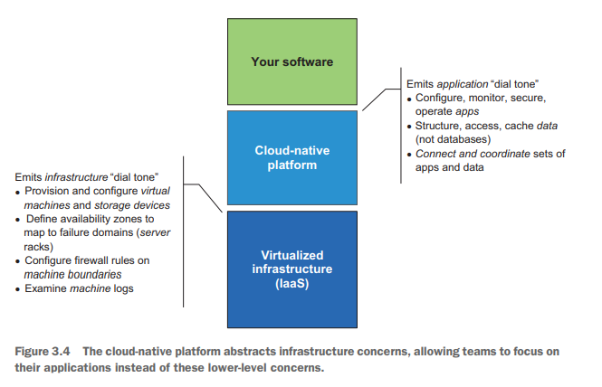
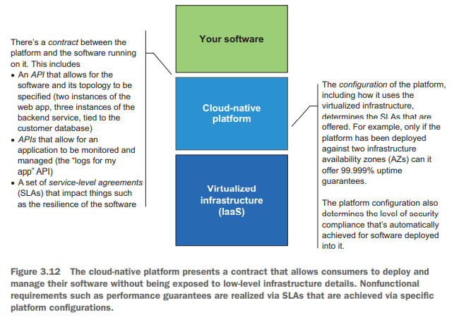

# Cloud Native Patterns - Ch. 3, The platform for cloud-native software

## Summary

- Cloud-native platform takes on the great burden of satisfying software
  requirements, and it's used through the entire SDLC.
- Cloud-native platform is a higher-level abstraction than that of
  infrastructure-centric platforms.
- App teams and platform teams can work independently.
- Eventual consistency is a promise of cloud-native platform as it
  monitors between actual and desired state and remediates when
  necessary.
- Cloud-native platform has baked in support for distributed systems.

## Intro Anecdote

The book covers an anecdote where a team moved their application to the
cloud, and the reliability of the application increased. The team
thought it was the refactoring done in order to move the app to the
cloud, but they discovered through log files that the application was
crashing *just* as much. It's the use of the cloud platform that gave
the application its resiliency. And no one had been able to notice.

## The cloud(-native) platform evolution

The cloud started with being concerned *where* computing was happening
rather than how it was happening. AWS started with lower-level
abstractions (IaaS), Google App Engine (GAE) and Azure started with
higher-level abstactions (PaaS).

In the past, developers/operators had to correctly configure the
application deployment, the infrastructure, etc. Take logging for
example: you would have to know what host are running the instance of
the app you care about and navigate to the correct area on the machine.
When the app is written with the cloud in mind, you ask for logs, and
it's available for you in a central place. You can focus on the
applications rather than the lower-level concerns.

## Core tenets of cloud platform

Cloud platform is about achieve resiliency and support highly
distributed apps.

Containers and cloud-native software enable each other. Container, as
defined purely as a computing context that uses functionality from
a host, are isolated from one another and are light weight. They consume
fewer resources and are created in less time. Everything that is needed
(and only what is needed) is installed to run your app: the OS,
application runtime, and application itself. Containers are assigned an
IP and distributed; routing is done amongst them. The health is
monitored, and the configuration injected into each.

Cloud-native software must also have support to be highly distributed.
Configuration needs to be updated among several instances. The execution
flow passing through dozens of microservices needs to be observable.
There must be retries without DDoSing your own system. The onus for this
isn't purely on the developer, as its part of the promised platform that
cloud delivers.

## Who does what?

By separating the boundaries of responsibilities into teams, you've
created a contract that adheres to the teams skills profile. Each team
owns a product and its lifecycle, and they create service-level
agreements (SLAs) in order to establish the contract between product and
customer. With the right contracts in place, teams are autonomous and
can execute their responsibilities without large-scale coordination.

