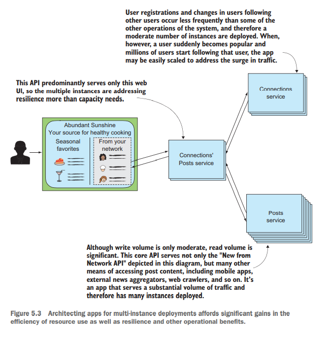
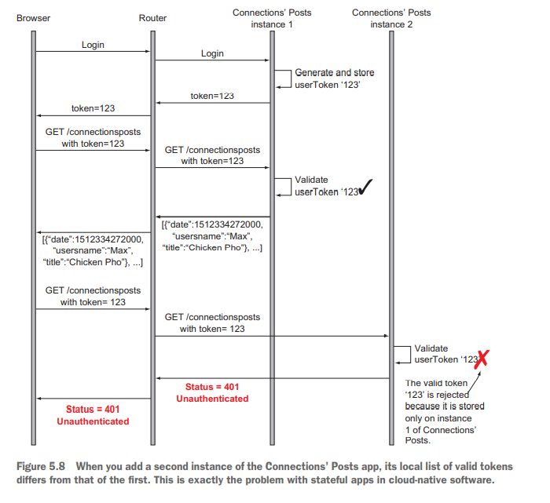

# Cloud Native Patterns - Ch. 5, App redundancy: Scale-out and statelessness

## Summary

- Stateful applications don't work well in a cloud-native context.
- A sequence of interactions with a user is a common way for state to
  creep into your application.
- Stateful services are a special type of service that must address the
  significant challenges of data resilience in a distributed,
  cloud-based setting.
- Most apps should be stateless and should offload the handling of state
  to these stateful services.
- Making apps stateless is simple and realizes significant advantages in
  a cloud setting.

## Cloud-native apps have many instances deployed

The prevailing model in the cloud is to scale horizontally (add/remove
app instances) to increase or decrease application capacity.

If you are currently running an application on a machine with 16 GB,
it's difficult to change that amount of memory to 20 GB. For one, you'd
have to go up to the next power of 2 which is 32 GB. Additionally, you
would have to start a new instance at 32 GB and get users on the new
instance before shutting down the old one.

It's far better to scale horizontally: you have 4 GB per app instance,
and you can just add an additional instance and make it known to the
dynamic router. And that's only the benefits from scaling that an
additional instance (rather than a more powerful machine) would provide.

## Stateful apps in the cloud

The book covers instructions to clone and run the Java project as three
different web APIs. The user tokens are stored in a hashmap in memory.
When the application is restarted or the user is routed to a different
instance, their token is no longer valid.

Sticky sessions were used in the past to route users to the appropriate
instance once they are assigned. There are a few problems with this
approach: what if the app no longer exists?

## Stateful services and stateless apps

There's not much to say here other than the author used redis to cache
the tokens and each instance connects to the redis cache. She does note
the challenges needed to make a stateful app and keep it stateful
(snapshots).