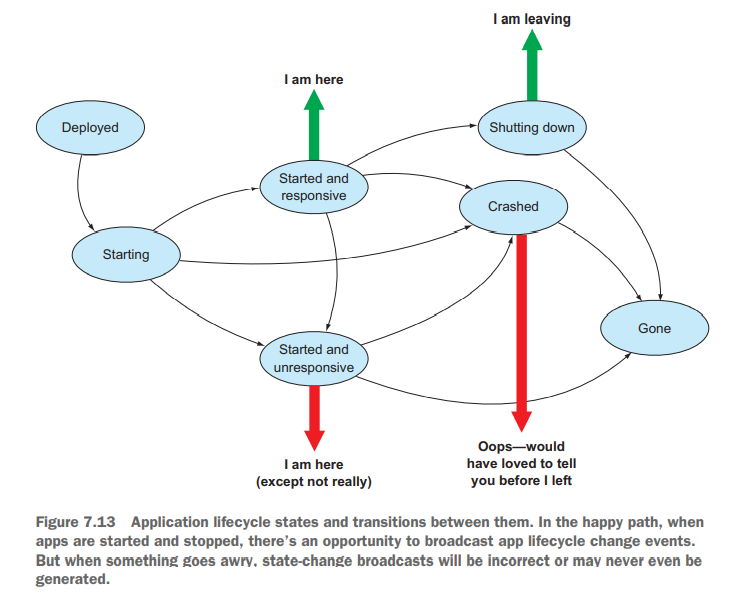

# Cloud Native Patterns - Ch. 7, The application lifecycle: Accounting for constant change

## Summary

- In cloud-native, an app must be treated as a single logical entity
  even while each app instance has its own lifecycle.
- Attention must be paid for how lifecycle events affect other apps in
  the distributed system.
- Zero downtime deployments: blue/green or rolling upgrade (rolling
  requires tolerating different versions at a time).
- App design must care about multiple possible credentials in order to
  have a rolling credential rotation.
- Let go of the past of not replacing app instances intentionally.
- Send application logs to stdout and stderr and let the cloud-native
  platform process them.
- Application state ought to be available so that it can be maintained
  and dependent apps can adapt.

## Having empathy for operations

Having empathy for operations is self-serving, since we are likely to be
doing ops as well as development.

Main operational concerns:

- *Manageability*: Management functions should be automateable,
  efficient, and reliable.
- *Resilience*: Platform should have a fail-safe way of detecting when
  an app has failed to recover.
- *Responsiveness*: Outputs should be received in a timely manner.
- *Cost management*: Being able to scale out/in and optimize away idle.

## Single-app lifecycle, multiple-instance lifecycles

It might seem wasteful to restart an app to pick up a configuration
change, especially with the use of an endpoint like `/refresh` which
would refresh application context (problem: load balancer would only
update 1 instance). You could also arrange something similar to refresh
that would refresh application state while the application is running,
but then it would have a state that can't be reproduced.

There are two viable options: rolling upgrades or blue/green
deployments.

A blue/green upgrade starts an instance of the new
configuration of the application without the load balancer directing
traffic to these instances; once they are all running and validated, the
load balancer directs all traffic to the new instances. There is only
one version of the application running at a time.

A rolling upgrade involves replacing instances of the application in
subsets. More than one version is running at a time. For this added
complexity, resource provisioning is reduced.

Parallel deployments are multiple versions running side by side (A/B
testing), but they place an increased importance on the observability of
the version of the software.

## Coordinating across different app lifecycles

Apps in a distributed system must be designed so that they don't need to
be updated in lockstep. Imagine trying to update a secret being used by
a service for a client to auth with. Instead of needing to update
a secret on both the client and service at the same time, the service
must be able to have more than one secret. Add the additional secret to
the service, deploy, modify the secret on the client, deploy, remove the
old secret from the service, deploy. These seem like a lot of
deployments, but this is okay -- cloud-native apps are designed for
ephemerality (change is the rule, not the exception).

## Dealing with ephemeral runtime environments

This is a long section, but it can be wrapped up very succintly: because
runtime environments are ephemeral, all metrics and logs are events that
should be streamed out for the platform to handle.

## Visibility of app lifecycle state

App lifecycle events affect other parts of your distributed system;
therefore, they must be accounted for. Events involving the state of the
app must be broadcast to other apps in some way (healthchecks!).

Rely on the platform to use the health checks to handle resiliency
operations, but utilize how you create the health checks to say what is
a healthy app or not. This may mean checking connections to databases or
caches, etc.
