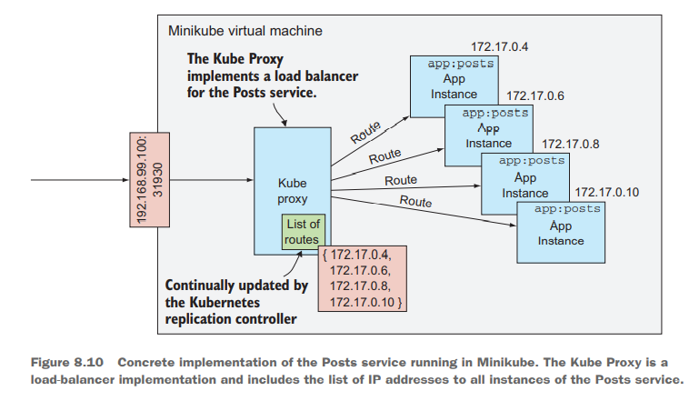
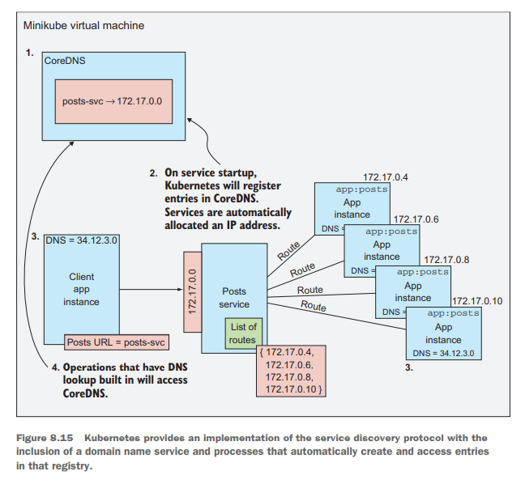

# Cloud Native Patterns - Ch. 8, Services, routing, and service discovery

## Summary

- A simple abstraction can be used to more loosely couple clients from
  dependent services.
- Two main load-balancing approaches are available—centralized (or
  server-side) and client-side. Each has advantages and disadvantages.
- Configuration of load balancers must be dynamic and highly automated
  because he instances to which traffic is routed are changing far more
  frequently than they have in the past.
- Naming services such as DNS are central to the service discovery
  protocol that allows clients to find dependent services even in
  a topology that’s constantly changing.
- When using a domain name service, you must account for the fact that
  the name-to-IP-address tables are eventually consistent. You must
  account for entries potentially being out of date.
- Using a service discovery protocol yields far more resilient software
  deployments.

## Dynamic routing

**Service discovery**: The means to find and access services.  
**Dynamic routing**: The means to distribute incoming requests across
the set of service instances.

### Server-side load balancing

Centralized load balancing has several advantages:

- The technology is mature and robust.
- It is easier to reason about compared to highly distributed.
- Configuration is easier than highly distributed.

They are often deployed as a cluster for scale and resilience.

### Client-side load balancing

Taking clusters of load-balancers to an extreme results in inclusion in
the clients themselves. This has become popular due to microservices
(and therefore the increase in network traffic).

- Libraries bundled into the code require a rebuild of application when
  an update is needed.
- Configuration may be more difficult.
- New architecture requires new learnings.
- Deployment options are limiting.

### Route freshness

A control loop constantly assesses the state of deployment and records
it into a routing table.

## Service discovery

A naming service allows a client to refer to a service by name. It
should minimize the window in which inconsistencies occur, have some
basic retries, and favor availability.

For server-side, this involves a name service that links to the load
balancer. But for client-side load balancing, the name service updates
and returns the list of app instances, and then the client picks one of
the app instances from there to access.

### Kubernetes

1. The Kubernetes cluster houses a DNS service called CoreDNS.
1. On startup, a service's name and address are added to the CoreDNS
   service.
1. All pods (apps) running in the Kubernetes environments have the
   address of the CoreDNS service configured in.
1. Any DNS-accessing operations, such as making an HTTP request to a URL
   that contains a name, access the CoreDNS service to resolve the
   address.

[zach: what keeps these problems we had previously from existing when we
are using CoreDNS's address from each app?]
